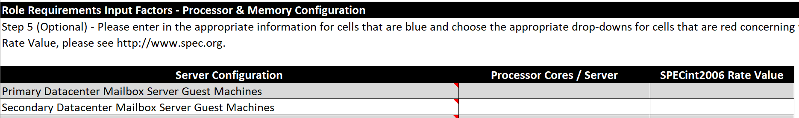
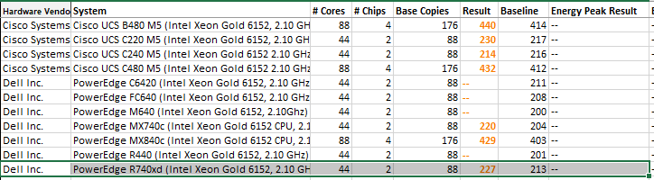
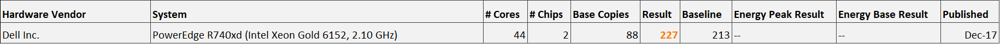
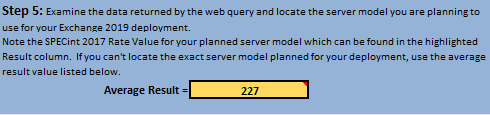
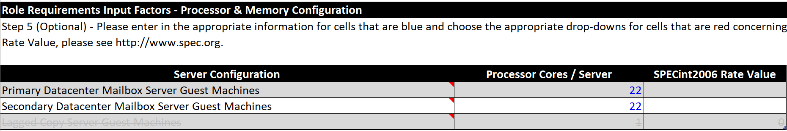
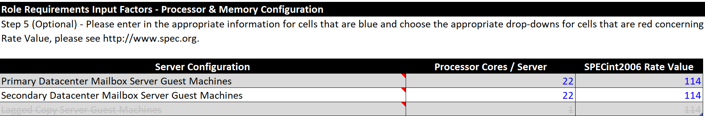
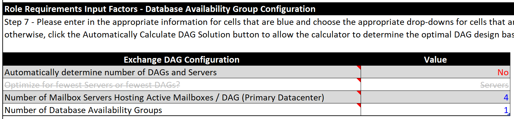
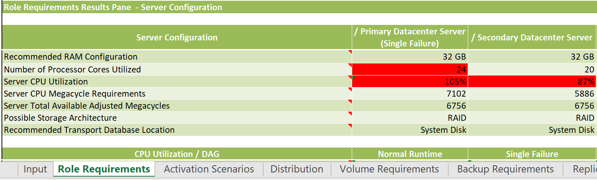
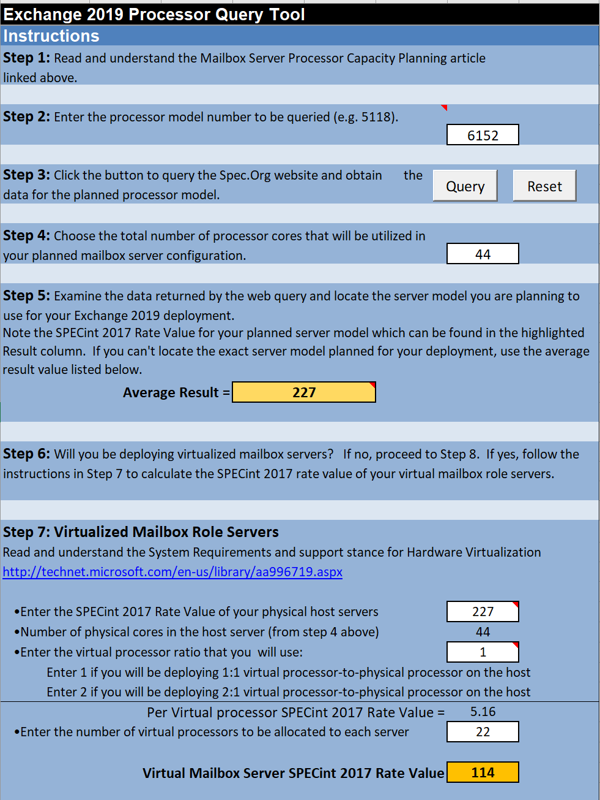

# Purpose

We need to fill the following from the Exchange Roles Requirements
Calculator:

For a physical machine, it's straightforward. But for a virtual machine,
it's a bit more complex.

NOTE: you can download the Exchange Processor Query Tool at the
following address: [Exchange Processor Query Tool - Microsoft Tech
Community](https://techcommunity.microsoft.com/t5/exchange-team-blog/exchange-processor-query-tool/ba-p/589402)

# Principle

The help note on the Server Configuration cells gives the following
formula:

**X / (N \* Y)**

Where:

-   **X** is the SpecInt value of the **physical** **host** (easy to
    find from the SpecInt site or with the help of the Exchange
    Processor Query tool aka EPQ tool)

-   **N** is the total number of CPUs on the host (also easy to find
    from the SpecInt site or with the help of the EPQ tool)

-   Y is the vCPU : physical core ratio we will have for the whole host.
    If the total target of vCPUs assigned to all Virtual Machines (the
    Guests) on the same host is twice as much as the total number of
    cores of the Host, the ratio will be 2:1. If the total target of
    vCPUs assigned to all VMs (Guets) on the host is the same as the
    total number of cores of the host, the ratio will be 1:1 =\> that
    will be the value of Y that we use:

    -   2 for a 2:1 ratio (twice more vCPU in total on guests than the
        number of physical cores of the host)

    -   1 for a 1:1 ratio

This gives a result that we multiply by the number of vCPU we put on
**one server**: if you have one server which you assign 22 cores, you
multiply the result of the above formula by 22 to get the value to put
on the **SPECint2006 Rate Value** column. And you put 22 on the "
**Processor Cores / Server**" column.

# Application

1.  Get the host server model and CPU type that you will use to host
    Exchange server(s)

    a.  Example: **Dell PowerEdge R740, with 2 x Intel Xeon Gold 6152
        CPU @ 2.10 GHz, 22 cores per CPU, and 1.5 TB of Memory**

2.  Note the processor model number (example, on the above, the
    processor is an Intel Xeon Gold 6152 CPU)

3.  Note the total number of processor cores that will be used for all
    the Exchange servers on that host (if you plan to use all, just note
    the total number of cores of the host, on the above example: 2 x 22
    cores = 44 cores)

4.  On the Specint2006 site or on the Exchange Processor Query Tool,
    search for the **CPU model** get the corresponding number

Example I put the CPU number on the corresponding field:

And I search on the result table for a **Dell PowerEdge R740** with an
Intel Xeon Gold **6152** processor, clicking the "**Query**" button:

And depending on the number of cores corresponding to your server you
put on the EPQ tool, here 44:

The tool does an average of all Results for 44 cores servers among the
results from the resulting table:

If you happen to find your exact server model, you can remove all other
rows of the result table, and only keep the one corresponding to your
server model:

The tool will put the average "Result" number, either the average of all
the 44 CPUs servers results, or the result of the model you found if you
remove all other servers from the table manually:

-   That's the SpecInt number of the host. **It's NOT the number we'll
    put on the SPECint2006 Rate value cell yet**. We have to use the
    formula described earlier in the doc (X / (N x Y) then multiply by
    the number of vCPUs you assign to your Exchange server)

5.  Now you have to know in advance if you will allocate 2 vCPUs : for 1
    physical core for all the guests (VMs) -- see the explanation
    earlier in that document.

6.  We can now use the formula X / (N \* Y) \* vCPUs

    a.  First part of the formula -- the Specint per vCPU

First we calculate the X / (N x Y) which actually corresponds to the
Specint value for each vCPU we'll assign:

-   X = 227

-   N = 44

-   Y = 1 if we allocate a total of 44 vCPUs, and Y=2 if we allocate a
    total of 88 vCPUs

**X / (N \* Y)** =\> **227 / (44 x 1)** = **5.16** =\> **[that's the per
vCPU Specint]{.ul}**.

Now we multiply this result by the number of vCPUs we will assign to the
Exchange server, assuming the host will have **2 Exchange VMs on that
host**, and we know that we will allocate **1 vCPU per 1 physical
core**, **each exchange server will have 22 vCPUs**

**[That 22 vCPUs we put on the "Processor Cores/Server" cell of the
Exchange Roles Requirements Calculator]{.ul}, as shown below:**

And we multiply the result of X/(N\*Y) by this number of vCPU we'll
assign to our server (22 vCPUs) to get the SPECint2006 Rate Value we'll
put on the calculator:

**X / (N \* Y) x vCPUs =\> 227 / (44 x 1) x 22 = 113.5 that we can round
to 114. Here's the value we put on the Exchange Roles Requirements
Calculator:**

# Results -- Conclusions

Before checking the results, check first the number of servers per DAG
that you plan to deploy, you can let the calculator to automatically
calculate the DAG structure, or put a number of servers yourself:

To check the results, switch to the "Role Requirements" tab, and the CPU
Utilization should be below 80%:

# Annex

7.  
